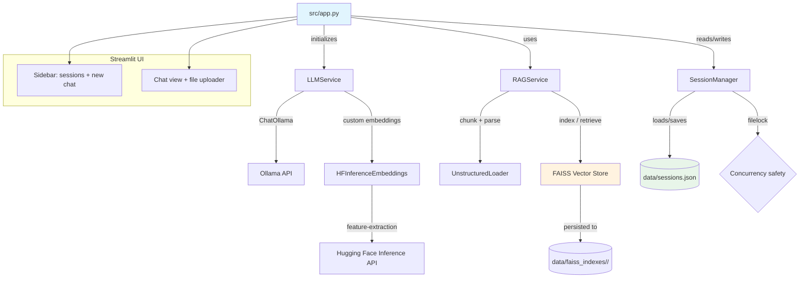
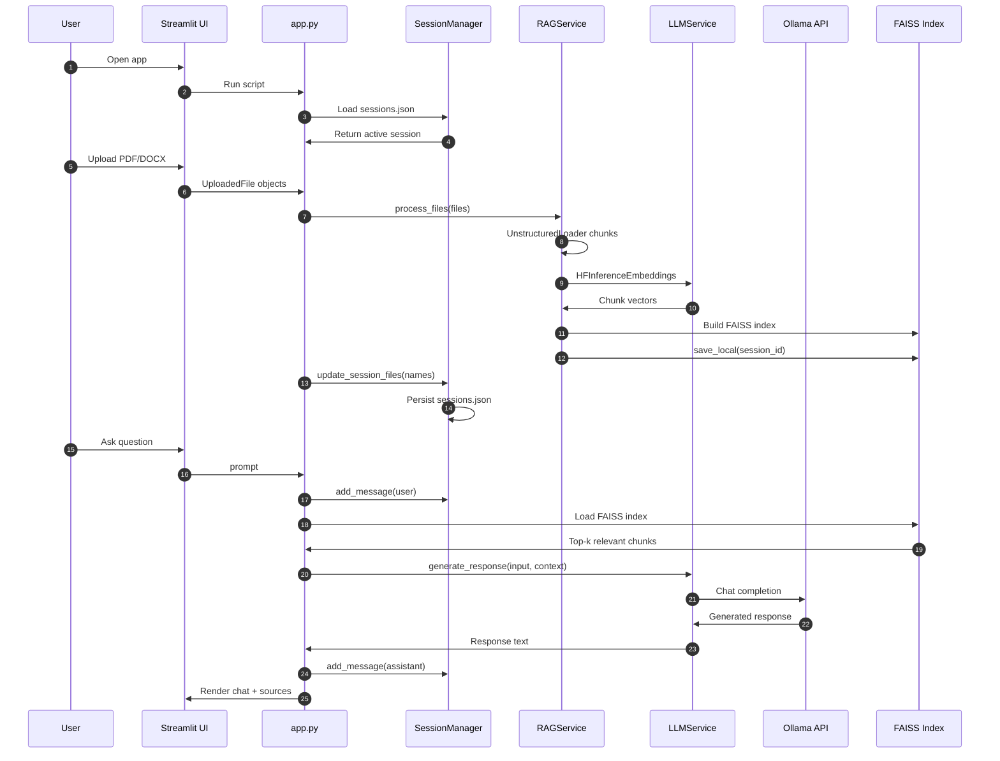

# RM GPT — AI-Powered Chat with Document RAG

A production-ready, single-user conversational AI application that combines a lightweight chat interface with **Retrieval-Augmented Generation (RAG)** over uploaded PDF and Word documents. Built with **Streamlit**, **LangChain**, **FAISS**, **Ollama**, and the **Hugging Face Inference API**.

> **Purpose:** This project demonstrates end-to-end GenAI engineering skills — from prompt engineering and vector retrieval to session persistence and clean, modular architecture — making it ideal for portfolio showcases, client demos, and recruiter evaluations.

---

## Live Demo

<!-- Replace the link below once deployed -->
**[Coming Soon — Deployed on Streamlit Community Cloud / Render / AWS EC2]**

Local preview:
```bash
pip install -r requirements.txt
streamlit run src/app.py
```

---

## What This Project Does

RM GPT lets a user:

1. **Start multiple chat sessions** with persistent history.
2. **Upload PDF or Word documents** to a specific session.
3. **Ask questions** about those documents — the app retrieves the most relevant chunks and feeds them into the LLM as context.
4. **Switch between sessions** without losing context or uploaded files.

The result is a personal AI assistant that "remembers" both the conversation and the documents attached to each chat.

---

## Why This Project Matters

This is not a toy wrapper around an LLM API. It demonstrates how to:

- Build a **real RAG pipeline** from scratch (chunking → embeddings → vector search → context-aware generation).
- Manage **stateful, multi-turn conversations** with persistent storage.
- Integrate multiple external services (Ollama, Hugging Face) behind a clean service layer.
- Structure a GenAI application so it can be **deployed and maintained**.

For recruiters and clients, this shows practical experience with the modern LLM application stack.

---

## Tech Stack

| Layer | Technology | Why It Was Chosen |
|-------|-----------|---------------------|
| **Frontend / UI** | Streamlit | Fast, Python-native UI with built-in chat widgets, file uploaders, and session state |
| **LLM Orchestration** | LangChain + LangChain-Ollama | Standardized chains, prompt templates, and Ollama integration via LCEL |
| **LLM Backend** | Ollama-compatible API (`ChatOllama`) | Runs powerful open-weight models cost-effectively; Bearer-token auth injected via `client_kwargs` |
| **Embeddings** | Custom `HFInferenceEmbeddings` over `huggingface_hub.InferenceClient` | Direct, normalized Hugging Face Inference API calls with shape-robust tensor handling |
| **Vector Store** | FAISS (CPU) | Fast, local in-memory / disk-persisted similarity search; no external vector DB needed |
| **Document Parsing** | `langchain-unstructured` `UnstructuredLoader` with `by_title` chunking | Handles PDF and Word files with semantic chunking |
| **Session Persistence** | JSON file + `filelock` | Simple, durable chat history without a full database |
| **Configuration** | Pydantic Settings + `.env` | Type-safe runtime config with environment-based secrets |
| **Data Models** | Pydantic | Validated `Message` and `ChatSession` schemas |

---

## Architecture Overview



---

## Data Flow



1. **Startup**
   - `SessionManager` loads `./data/sessions.json`.
   - If no sessions exist, a default chat is created.
   - `LLMService` and `RAGService` are initialized once in `st.session_state`.

2. **Uploading a File**
   - `app.py` receives `UploadedFile` objects via `st.file_uploader`.
   - `RAGService.process_files()` writes each file to a temporary path, loads it with `UnstructuredLoader`, and collects chunks.
   - `FAISS.from_documents()` builds a local vector index using the custom Hugging Face embeddings.
   - `RAGService.save_vector_store()` persists the index to `./data/faiss_indexes/<session_id>/`.
   - `SessionManager.update_session_files()` records the file names and sets `has_vector_store=True`.

3. **Sending a Message**
   - The user message is appended to the active session.
   - If `has_vector_store` is true, `RAGService` loads the FAISS index, retrieves top-k chunks, formats them as context, and calls `LLMService.generate_response(input, context)`.
   - Otherwise, it calls `LLMService.generate_response(input)` for plain Q&A.
   - The assistant response is appended to the session and saved to disk.

4. **Switching Sessions**
   - Sidebar buttons call `SessionManager.set_active_session()`, and the UI reruns with the selected session's messages and attached files.

---

## Project Structure

```
rm-gpt/
├── src/
│   ├── app.py                        # Streamlit entry point and UI orchestration
│   ├── config.py                     # Pydantic settings + directory setup
│   ├── models.py                     # Pydantic Message and ChatSession models
│   └── services/
│       ├── llm_service.py            # ChatOllama setup, prompt chains, generation
│       ├── embeddings_service.py     # Custom HF Inference API embeddings adapter
│       ├── rag_service.py            # Document ingestion, FAISS indexing, retrieval
│       └── session_manager.py        # JSON-backed session persistence with filelock
├── data/
│   ├── sessions.json                 # Persisted chat sessions (gitignored)
│   └── faiss_indexes/              # Per-session FAISS indexes (gitignored)
├── .venv/                            # Local Python virtual environment
├── .env.example                      # Template for required secrets
├── .gitignore                        # Ignores .env, data/, .venv, .claude/
├── requirements.txt                  # Direct Python dependencies
├── CLAUDE.md                         # Internal project guidance for Claude Code
└── README.md                         # You are here
```

---

## Key Features

- **Session-based chat**: Create unlimited chats, each with its own history and files.
- **Multi-file RAG**: Attach PDF and Word documents to a session and ask questions about them.
- **Persistent state**: Chat history and vector stores survive application restarts.
- **Modular services**: LLM, RAG, embedding, and session logic are cleanly separated.
- **Custom embeddings adapter**: Handles scalar, 2D, and multi-dimensional API responses robustly.
- **Safe file handling**: Temp files are cleaned up after parsing.
- **Bearer-token auth**: Ollama requests include a configurable `Authorization` header.

---

## Setup Instructions

### 1. Clone the Repository

```bash
git clone https://github.com/rm-ai-portfolio/rm-gpt.git
cd rm-gpt
```

### 2. Create a Virtual Environment

```bash
python -m venv .venv
# On Windows:
.venv\Scripts\activate
# On macOS/Linux:
source .venv/bin/activate
```

### 3. Install Dependencies

```bash
pip install -r requirements.txt
```

### 4. Configure Environment Variables

```bash
cp .env.example .env
```

Edit `.env` with your actual credentials:

```env
OLLAMA_API_KEY=your_api_key
LLM_MODEL=glm-5.2:cloud
OLLAMA_BASE_URL=https://your-ollama-endpoint
HF_TOKEN=hf_your_token
HF_EMBEDDING_MODEL=google/embeddinggemma-300m
```

> **Note:** `LANGSMITH_*` variables are present in `.env.example` but LangSmith tracing is not wired up in the current code.

### 5. Run the App

```bash
streamlit run src/app.py
```

Open the local URL printed in the terminal (default: `http://localhost:8501`).

---

## Deployment Options

Because the app stores state on disk (`./data/`), it is designed for **single-user / single-instance** deployments.

### Streamlit Community Cloud (Free)

1. Push this repo to GitHub (already done).
2. Go to [share.streamlit.io](https://share.streamlit.io) and connect the repo.
3. Add secrets via the Streamlit Cloud UI matching `.env.example`.
4. Deploy.

### Render / Railway / Fly.io

- Use a service that preserves disk for a single instance, or mount a small volume for `./data/`.
- Set all environment variables in the platform dashboard.
- Start command: `streamlit run src/app.py --server.port 8501`.

### AWS EC2 / VPS

```bash
ssh into instance
git clone <repo>
cd rm-gpt
python -m venv .venv && source .venv/bin/activate
pip install -r requirements.txt
cp .env.example .env
# edit .env
streamlit run src/app.py --server.port 8501
```

For production, run behind Nginx or use a process manager like `systemd` or `supervisor`.

---

## Skills Demonstrated

| Skill | Evidence in This Project |
|-------|---------------------------|
| **LLM Application Development** | End-to-end LangChain + Ollama integration with custom prompt templates |
| **Retrieval-Augmented Generation** | Document chunking, FAISS vector search, context injection into prompts |
| **Embeddings Engineering** | Custom adapter class for Hugging Face Inference API with tensor normalization |
| **State Management** | JSON-backed session persistence with concurrent-safe writes |
| **Python Architecture** | Service-layer pattern, Pydantic models, clean separation of concerns |
| **Streamlit UI Development** | Chat messages, file uploader, sidebar navigation, conditional rendering |
| **Environment & Secret Management** | Pydantic Settings with `.env`, no hardcoded credentials |
| **Deployment Readiness** | Disk-persisted state, single-instance deploy instructions |

---

## Future Enhancements

- [ ] Multi-user support with per-user authentication and isolated session stores.
- [ ] Conversation title auto-generation from the first user message.
- [ ] Streaming responses with `st.write_stream` for a smoother UX.
- [ ] Integration with a managed vector database (e.g., Pinecone, Weaviate) for horizontal scaling.
- [ ] Docker image and `docker-compose.yml` for one-command deployment.

---

## About the Author

Built by **Ronit Mukherjee** as a portfolio project to demonstrate practical GenAI and full-stack AI engineering skills.

- GitHub: [rm-ai-portfolio](https://github.com/rm-ai-portfolio)
- Email: connect.ronit@gmail.com
- LinkedIn: *https://www.linkedin.com/in/mukherjeeronit/*

If you are a recruiter or hiring manager and would like a walkthrough, feel free to reach out.

---

## License

This project is provided as-is for portfolio and educational purposes. You may use the code as a reference, but please do not deploy it in production without adding authentication, rate limiting, and security hardening.
